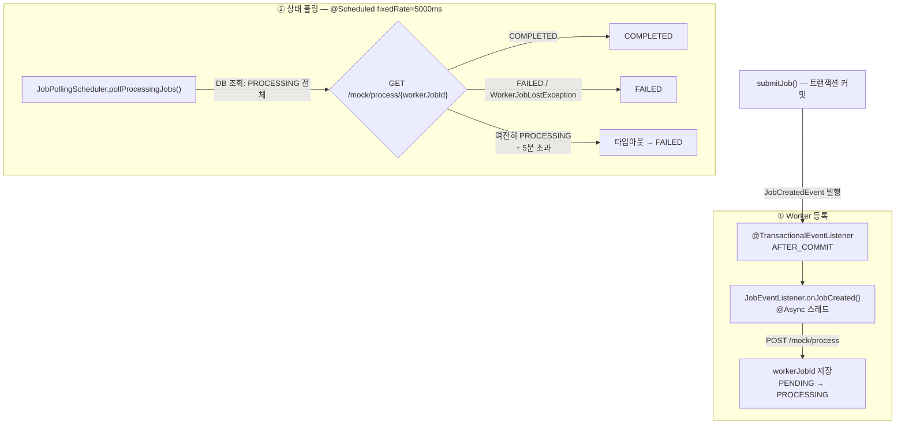
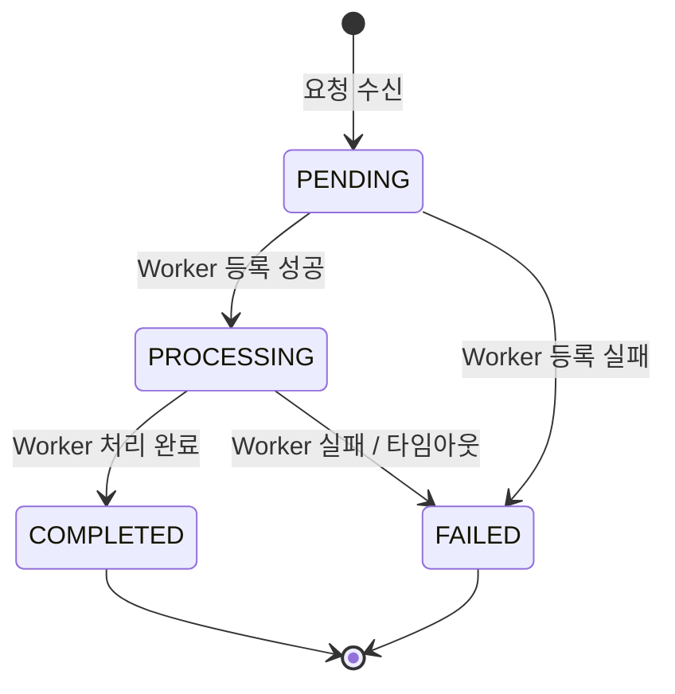
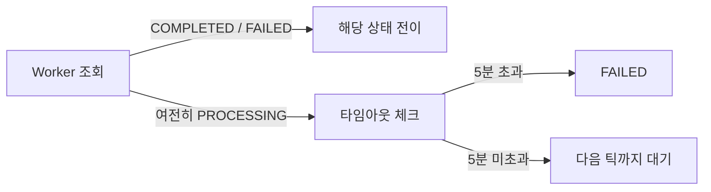
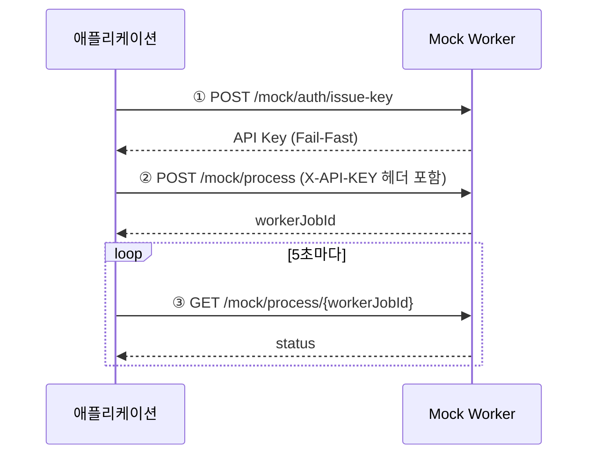
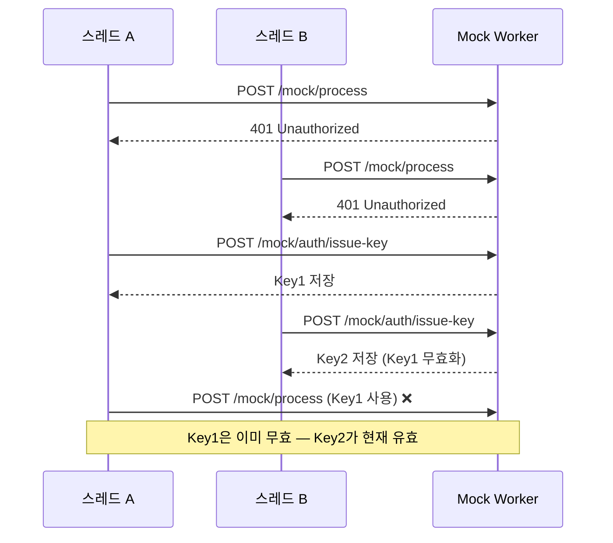
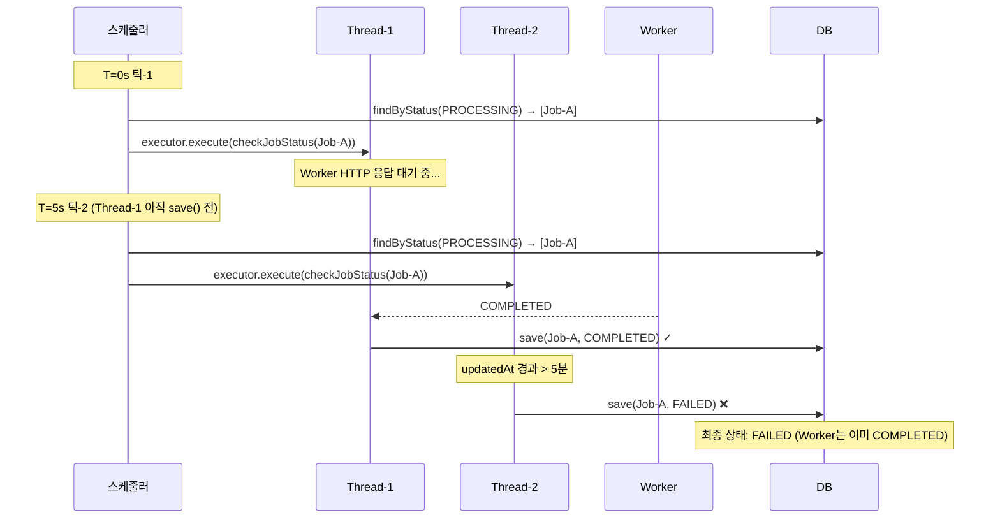
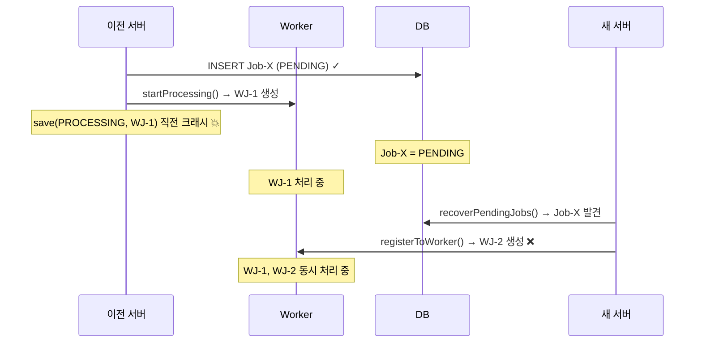

# Image Processing Job API

Spring Boot 3.3 기반 비동기 이미지 처리 서비스입니다. 클라이언트 요청을 수신하여 외부 Mock Worker에 작업을 위임하고, 폴링으로 상태를 추적합니다.

---

## 실행 방법

```bash
docker compose up
```

| 서비스    | 포트                            |
|--------|-------------------------------|
| API 서버 | `8080`                        |
| MySQL  | `33306` (호스트) / `3306` (컨테이너) |

> 별도 계정이나 자격 증명 없이 실행 가능합니다. API Key 발급은 애플리케이션 시작 시 자동으로 수행됩니다.

### swagger api 문서 링크

spring 서버 실행 후, 아래 링크에서 api 실행을 테스트할 수 있습니다.

```
http://localhost:8080/swagger-ui/index.html
```

---

## API 엔드포인트

모든 응답은 `CommonApiResponse<T>` 공통 응답 구조로 감싸집니다.

```json
{
  "success": true,
  "data": { ... },
  "error": null,
  "details": null
}
```

검증 오류 시 `details` 필드에 필드별 메시지 목록이 포함됩니다. `error`는 항상 `String | null`로 고정되어 클라이언트의 역직렬화 타입 계약이 깨지지 않습니다.

---

### 작업 제출

```
POST /api/v1/jobs
```

| 헤더                | 설명            | 필수 |
|-------------------|---------------|----|
| `Idempotency-Key` | 멱등키 (최대 255자) | O  |

**요청 바디**

```json
{
  "imageUrl": "https://example.com/image.jpg",
  "userId": "user-001"
}
```

**응답** `202 Accepted` (신규) / `200 OK` (중복)

```json
{
  "success": true,
  "data": {
    "jobId": "550e8400-e29b-41d4-a716-446655440000",
    "idempotencyKey": "my-key-001",
    "userId": "user-001",
    "imageUrl": "https://example.com/image.jpg",
    "status": "PENDING",
    "result": null,
    "errorMessage": null,
    "createdAt": "2024-01-01T00:00:00Z"
  },
  "error": null,
  "details": null
}
```

`202 Accepted`를 반환하는 이유: 이미지 처리는 비동기로 진행되므로 요청 수신 시점에 작업이 완료된 것이 아닙니다. `201 Created`는 리소스가 즉시 생성 완료됨을 의미하므로
`202`가 HTTP 의미론에 맞습니다.

동일 `(userId, idempotencyKey)` 조합의 중복 요청은 `200 OK`로 기존 작업을 반환합니다.

---

### 작업 상태 조회

```
GET /api/v1/jobs/{jobId}
```

`jobId`는 UUID 형식이어야 합니다. 형식 오류 시 `400`, 존재하지 않으면 `404`를 반환합니다.

**응답** `200 OK`

```json
{
  "success": true,
  "data": {
    "jobId": "550e8400-e29b-41d4-a716-446655440000",
    "status": "COMPLETED",
    "result": "처리된 이미지 결과",
    "errorMessage": null,
    "createdAt": "2024-01-01T00:00:00Z"
  },
  "error": null,
  "details": null
}
```

---

### 작업 목록 조회

```
GET /api/v1/jobs?page=0&size=20
```

**응답** `200 OK`

```json
{
  "success": true,
  "data": {
    "content": [ { "jobId": "...", "status": "COMPLETED" } ],
    "page": 0,
    "size": 20,
    "totalElements": 100,
    "totalPages": 5,
    "last": false
  },
  "error": null,
  "details": null
}
```

---

## 아키텍처 개요: 이벤트 기반 비동기 처리

요청 수신과 Worker 처리를 분리하는 이벤트 기반 구조를 채택했습니다. `submitJob()`은 Job을 PENDING으로 저장하고 즉시 응답을 반환합니다. Worker 등록과 상태 폴링은 별도
흐름으로 진행됩니다.



**`@TransactionalEventListener(AFTER_COMMIT)`을 선택한 이유**: `submitJob()` 내부에서 직접 `@Async`를 호출하면, 비동기 스레드가
`findByJobId()`를 실행하는 시점에 트랜잭션이 아직 커밋되지 않아 DB에 레코드가 없을 수 있습니다. `AFTER_COMMIT`은 이벤트 발행을 커밋 이후로 연기하여 비동기 스레드가 DB에서
Job을 안전하게 읽을 수 있도록 보장합니다.

**`@Scheduled(fixedRate = 5000)` 선택 근거**: `pollProcessingJobs()`는 `executor.execute()`를 호출한 뒤 즉시 반환하는 비동기 구조입니다.
`fixedDelay`는 "완료 후 N초 대기"를 의미하여 동기적으로 오래 걸리는 케이스에 적합합니다. "5초마다 폴링"이라는 의도를 명확하게 표현하는 `fixedRate`를 선택했습니다.

**`JobEventListener`와 `JobPollingScheduler`를 분리한 이유**: 이벤트 리스너는 "새 Job이 생겼을 때 Worker에 등록"이라는 단일 책임을 가지고, 폴링은 "
주기적으로 모든 PROCESSING Job을 확인"이라는 별개 책임입니다. 한 클래스에 두면 이벤트 트리거 로직과 스케줄 트리거 로직이 뒤섞여 변경 시 서로에게 영향을 줍니다.

---

## 상태 모델



| 상태           | 설명                              |
|--------------|---------------------------------|
| `PENDING`    | 요청 수신, Worker 미등록               |
| `PROCESSING` | Worker에 등록됨, 결과 폴링 중            |
| `COMPLETED`  | 처리 완료, result 저장됨               |
| `FAILED`     | 처리 실패 또는 타임아웃, errorMessage 저장됨 |

터미널 상태(`COMPLETED`, `FAILED`)에서의 역전이는 `IllegalStateException`으로 즉시 실패합니다. 조용히 무시하면 데이터 정합성이 깨지고 버그 탐지가 늦어지기
때문입니다 (Fail Fast 원칙).

### 타임아웃 감지: Worker 조회 우선 전략

PROCESSING Job의 타임아웃 판단 순서가 중요합니다.



이미지 처리는 비용이 크고 시간이 많이 소요됩니다. Worker가 이미 처리를 완료했음에도 `updatedAt`이 오래됐다는 이유만으로 FAILED 처리하는 것은 명백한 낭비입니다. Worker에 먼저
조회하고, Worker가 여전히 PROCESSING이라고 응답하는 경우에만 타임아웃을 적용합니다.

### Known Limitation: `workerJobId=null` PROCESSING

`tryClaimJob()` 선점 성공(PROCESSING으로 DB 업데이트) → HTTP Worker 호출 성공 → `save(workerJobId)` 실패 순서로 장애가 발생하면 DB에
`workerJobId=null`인 PROCESSING Job이 잔존합니다.

폴링 스케줄러가 이 Job을 발견하면 `pollStatus(null)`이 `WorkerJobLostException`으로 처리되어 FAILED로 기록됩니다 — Worker가 정상 완료했더라도.

**왜 완전히 해결하지 않았는가**: 해결하려면 Worker API에 멱등성 키 지원이 필요합니다. 없이 재호출하면 Worker에 중복 Job이 생성되어 오분류보다 더 심각한 부작용이 발생합니다. 발생
조건은 HTTP 응답 수신 직후 수 밀리초 이내에 DB save()가 실패해야 하는 극히 좁은 타이밍이며, 스케줄러가 FAILED로 정리하므로 영구 방치는 없습니다. **알려진 한계(Known
Limitation)로 관리**합니다.

---

## 외부 시스템 연동 (Mock Worker)

**Base URL**: `https://dev.realteeth.ai/mock`

### 연동 흐름



### 설계 선택 근거

| 항목            | 선택                                     | 이유                                                                                                  |
|---------------|----------------------------------------|-----------------------------------------------------------------------------------------------------|
| HTTP 클라이언트    | `RestClient` (Spring 6.1+)             | `RestTemplate`은 Spring 6부터 유지보수 모드, `WebClient`는 reactive 스택 전체가 필요하여 MVC 환경에 부적합                   |
| 타임아웃          | connect 5s / read 15s                  | Mock Worker 명세의 "수 초~수십 초 변동" 대응. 타임아웃 없으면 스레드풀이 고갈되어 서버 전체가 응답 불능                                  |
| API Key 발급 시점 | 시작 시 즉시 (`SmartInitializingSingleton`) | 유효하지 않은 Key로 작업 처리를 막는 Fail-Fast. `ApplicationReadyEvent`보다 이른 시점에 예외를 던져 Spring Boot가 진짜 기동 실패로 처리 |
| Worker 조회 우선  | 타임아웃 판단 전 Worker 조회                    | 완료된 이미지 처리 결과를 폐기하지 않기 위함                                                                           |

### HTTP 오류 응답 처리 전략

Worker API는 상태 코드별로 다른 복구 전략을 적용합니다.

| 상태 코드 | 의미 | 처리 방식 |
|---------|------|---------|
| `401 Unauthorized` | API Key 만료 | `ReentrantLock`으로 재발급 직렬화 후 재시도 (아래 섹션 참고) |
| `429 Too Many Requests` | Worker 과부하 | 지수 백오프(exponential backoff) 후 재시도 |
| `404 Not Found` | workerJobId 유실 | `WorkerJobLostException` 발생 → 폴링 스케줄러가 FAILED 처리 |

**429 백오프를 선택한 이유**: Worker는 GPU 리소스가 한정된 외부 서비스입니다. 즉시 재시도하면 Worker 부하가 더 악화됩니다. 지수 백오프로 요청 간격을 늘려 Worker가 회복할 시간을 확보합니다.

**404를 `WorkerJobLostException`으로 처리한 이유**: `workerJobId`가 존재하는데 Worker가 404를 반환한다면 Worker 측 데이터가 유실된 것입니다. 이는 일시적 오류(`5xx`)와 달리 재시도로 해결되지 않으므로 즉시 FAILED 전이가 적절합니다. 타임아웃 대기 없이 빠르게 실패 상태를 확정하여 클라이언트가 재제출 여부를 판단할 수 있게 합니다.

---

### API Key 동시 재발급 직렬화

여러 `@Async` 스레드가 동시에 `401`을 받으면 경쟁 조건이 발생합니다. Mock Worker 동작 구조를 조사한 결과, "API Key는 발급할 때마다 달라진다"는 점을 알게 되었습니다.



`ReentrantLock`으로 재발급을 직렬화합니다. `tryLock()`으로 잠금을 시도해 성공한 첫 번째 스레드만 재발급을 수행하고, 나머지 스레드는 `lock()`으로 재발급 완료를 기다린 뒤
새 키로 재시도합니다. 결과적으로 재발급 HTTP 호출이 딱 1회만 발생합니다.

`synchronized` 대신 `ReentrantLock`을 사용한 이유: `synchronized`는 모든 대기 스레드가 블록 안으로 진입해 재발급을 반복합니다. `tryLock()` +
`lock()` 패턴으로 "첫 번째 스레드만 재발급, 나머지는 결과 대기 후 진행"을 구현했습니다.

---

## 데이터 정합성: 발견 및 수정한 버그

구현 검증 과정에서 데이터 정합성 버그 3건을 발견하고 수정했습니다.

### C-1: 스케줄러 중복 틱 → COMPLETED가 FAILED로 덮어쓰기

**발생 시나리오**:



**근본 원인**: `pollProcessingJobs()`는 `executor.execute()` 호출 직후 즉시 반환하므로, 이전 틱의 비동기 스레드가 `save()` 직전인 상태에서 다음 틱이
동일한 Job을 DB에서 다시 로드할 수 있습니다. `@Version` 기반 낙관적 잠금이 없으면 나중에 실행된 스레드가 선행 스레드의 결과를 덮어씁니다.

**수정 방안 비교**:

| 방안                | 결과                                                                              |
|-------------------|---------------------------------------------------------------------------------|
| `@Version` 낙관적 잠금 | 충돌 스레드에서 `ObjectOptimisticLockingFailureException` 발생 → 선행 결과 보존. 구현 단순, JPA 표준 |
| 비관적 잠금(`@Lock`)   | DB 행 잠금으로 원천 차단. 단, 잠금 경합으로 Job 수 증가 시 처리량 저하                                   |
| 동기 실행 전환          | 중복 틱 원천 제거. 단, Worker HTTP 응답 시간이 틱 주기에 직접 영향 → 순차 처리 병목                        |

**선택: `@Version Long version` 필드 추가.** 구현 복잡성 최소화, 비동기 처리량 유지, 충돌 시 다음 폴링 틱에서 자연 회복.

---

### C-2: 서버 재시작 시 PENDING Job 이중 Worker 등록

**발생 시나리오**:



**`isPending()` 가드가 무력화되는 이유**: 두 스레드(`recoverPendingJobs`와 `onJobCreated`)가 각자 독립적으로 DB에서 Job을 로드하면, 메모리 수준의
`isPending()` 체크는 Race Condition을 막지 못합니다.

**수정 방안 비교**:

| 방안                                             | 결과                                             |
|------------------------------------------------|------------------------------------------------|
| DB 레벨 원자적 선점 (`UPDATE WHERE status='PENDING'`) | HTTP 호출 전 DB에서 소유권 확보. 잠금 없이 CAS 방식으로 이중 등록 차단 |
| 비관적 잠금 (`SELECT FOR UPDATE`)                   | HTTP 호출 수백 ms 동안 DB 행 잠금 유지 → 처리량 저하           |
| 분산 잠금 (Redis)                                  | 단일 서버 환경에서 오버엔지니어링. Redis 장애 시 Worker 등록 불가    |
| Worker API 멱등성 키                               | Worker API 스펙 변경 필요 (제어권 없음)                   |

**선택: `tryClaimJob()` — DB 원자적 선점.**

```java

@Modifying
@Query("UPDATE Job j SET j.status = 'PROCESSING' WHERE j.jobId = :jobId AND j.status = 'PENDING'")
int tryClaimJob(@Param("jobId") UUID jobId);
```

HTTP 호출 전 `tryClaimJob()`이 성공한 스레드(rowsAffected=1)만 Worker를 호출합니다. 실패한 스레드(rowsAffected=0)는 처리를 건너뜁니다.

---

### C-3: 3단계 분산 작업의 원자성 문제 (C-2 수정으로 함께 해결)

**원래 문제**: `registerToWorker()` 내부의 세 작업(DB 조회 → HTTP 호출 → DB 저장)이 각각 별도 트랜잭션으로 실행됩니다. HTTP 호출 성공 후 `save()` 실패
시 DB는 PENDING으로 남아 스케줄러 폴링 대상에서 누락되고, Worker Job은 고아 상태가 됩니다.

**C-2 수정 후 해소**: `tryClaimJob()`이 HTTP 호출 이전에 별도 트랜잭션으로 커밋되므로, 이후 `save()` 실패가 발생해도 DB 상태는 PENDING이 아닌
PROCESSING으로 남습니다. 스케줄러가 다음 틱에서 해당 Job을 폴링하여 자동 처리합니다.

---

## 처리 보장 모델 (4.3)

**At-Least-Once** 모델을 채택합니다.

### At-Least-Once가 보장되는 이유

| 시나리오                         | 동작                                                      |
|------------------------------|---------------------------------------------------------|
| PENDING Job이 있을 때 서버 재시작     | `recoverPendingJobs()`가 기동 시 재제출 → 처리 유실 없음             |
| PROCESSING 중 서버 재시작          | 폴링 스케줄러가 다음 틱(최대 5초 후)에 자동 재개 → Worker 완료 결과 복구         |
| Worker HTTP 성공 후 DB 저장 전 크래시 | DB에 PENDING 잔존 → 재시작 시 Worker 재호출 → 동일 작업이 두 번 처리될 수 있음 |

마지막 시나리오가 "At-Least-Once"의 핵심입니다 — 처리 유실은 없지만 드물게 Worker 중복 호출이 발생할 수 있습니다.

### Exactly-Once가 불가한 이유

"Worker 호출 성공"과 "DB 저장 성공"을 원자적으로 보장하려면 Worker API의 멱등성 지원이 필요합니다. 현재 Worker API는 멱등성 키를 지원하지 않아 "Exactly-Once"를
보장할 수 없습니다.

클라이언트 관점에서는 멱등키로 중복 응답을 차단하지만, Worker 호출 자체는 드물게 중복될 수 있습니다.

---

## 중복 요청 처리 (4.1)

멱등키 기반 2단계 방어 전략을 사용합니다.

1. **서비스 레이어**: `(userId, idempotencyKey)` 조합으로 기존 작업 조회 후 존재하면 즉시 반환 → 불필요한 예외 없이 gracefully 처리
2. **DB UNIQUE 제약**: `UNIQUE(user_id, idempotency_key)` → 서비스 레이어 확인과 신규 생성 사이의 경쟁 조건 최종 방어

멱등키는 서비스 전체가 아닌 **유저 범위**로 제한합니다. 서로 다른 유저는 동일한 키를 독립적으로 사용할 수 있습니다.

`Idempotency-Key` 헤더 검증은 `@Validated + @Size(max = 255)` 조합으로 선언적으로 처리합니다. `@RequestBody @Valid`와 달리
`ConstraintViolationException`이 발생하므로 `GlobalExceptionHandler`에 별도 핸들러가 등록되어 있습니다.

---

## 서버 재시작 시 동작 (4.4)

### 복구 전략

| 상태           | 복구 방법                                                                |
|--------------|----------------------------------------------------------------------|
| `PENDING`    | `ApplicationReadyEvent` 수신 시 `recoverPendingJobs()` 호출 → Worker에 재제출 |
| `PROCESSING` | 폴링 스케줄러가 다음 틱(최대 5초 후)에 자동 재개 — 별도 복구 로직 불필요                         |

`recoverPendingJobs()`를 `@PostConstruct`가 아닌 `ApplicationReadyEvent`에 연결한 이유: `@PostConstruct`는 빈 초기화 시점에 실행되어
DB 연결이나 트랜잭션 인프라가 완전히 준비되지 않았을 수 있습니다. `ApplicationReadyEvent`는 모든 빈과 컨텍스트가 완전히 준비된 후 발생하므로 DB 접근이 안전합니다.

### 재시작 시 데이터 정합성 위험 지점

| 상황                                    | 결과                             | 처리 방식                                                     |
|---------------------------------------|--------------------------------|-----------------------------------------------------------|
| Worker 호출 성공 후 DB 저장 전 크래시            | DB는 PENDING, Worker에 고아 작업 존재  | 재시작 시 PENDING 재실행 → Worker 중복 호출 가능 (At-Least-Once 허용 범위) |
| 동시 멱등키 삽입 경쟁                          | DB UNIQUE 제약 위반 → 한쪽 트랜잭션 롤백   | DB가 최종 보장                                                 |
| `workerJobId=null`인 PROCESSING Job 잔존 | `pollStatus(null)` → FAILED 처리 | Known Limitation (Worker API 멱등성 미지원으로 완전 해결 불가)          |

---

## 트래픽 병목 지점

| 병목                            | 원인                                   | 대응                               |
|-------------------------------|--------------------------------------|----------------------------------|
| `ThreadPoolTaskExecutor` 큐 포화 | 큐 용량(100) 초과 시                       | `CallerRunsPolicy` 배압 제어         |
| `status` 컬럼 전체 스캔             | 5초마다 `WHERE status='PROCESSING'` 풀스캔 | `idx_jobs_status` 추가로 해소 (아래 참고) |

### CallerRunsPolicy 선택 근거

큐 포화 시 4가지 정책의 동작을 비교했습니다.

| 정책                    | 동작                              | 이 시스템에서의 문제                                |
|-----------------------|---------------------------------|--------------------------------------------|
| `AbortPolicy` (기본)    | `RejectedExecutionException` 던짐 | 스케줄러 `forEach` 내부에서 처리되지 않은 채 전파           |
| `DiscardPolicy`       | 조용히 버림                          | Job 폴링 누락이 눈에 띄지 않음                        |
| `DiscardOldestPolicy` | 큐에서 가장 오래된 항목 제거                | 의도치 않은 순서 변경                               |
| `CallerRunsPolicy`    | 호출한 스레드(스케줄러)가 직접 실행            | 자연스러운 배압 — 큐가 빌 때까지 다음 `execute()` 호출이 지연됨 |

`CallerRunsPolicy`를 선택한 이유: 큐가 꽉 찼을 때 스케줄러 스레드 자체가 작업을 실행합니다. 스케줄러 스레드가 묶여 있는 동안 다음 `execute()` 호출이 대기하므로 제출 속도가
자동으로 조절됩니다. Job을 버리거나 예외를 던지지 않으면서 시스템이 감당할 수 있는 수준으로 자연스럽게 제어됩니다.

---

## DB 인덱스 전략

| 인덱스               | 컬럼                           | 생성 이유                            |
|-------------------|------------------------------|----------------------------------|
| PK                | `id`                         | 기본 엔티티 조회                        |
| UNIQUE            | `job_id`                     | `findByJobId()`, `tryClaimJob()` |
| UNIQUE            | `(user_id, idempotency_key)` | 중복 요청 최종 방어                      |
| `idx_jobs_status` | `status`                     | 5초마다 실행되는 스케줄러 풀스캔 방지            |

### `idx_jobs_status` 추가 판단 근거 (EXPLAIN 실측)

`WHERE status = 'PROCESSING'` 쿼리가 5초마다 실행됩니다. 인덱스 추가 전후 실제 MySQL EXPLAIN 결과를 비교했습니다.

**인덱스 추가 전 (type=ALL, 풀스캔)**

| type  | key    | rows | filtered | Extra         |
|-------|--------|------|----------|---------------|
| `ALL` | `NULL` | 100  | 10.00    | `Using where` |

**인덱스 추가 후 (type=ref, 인덱스 사용)**

| type  | key               | rows | filtered | Extra                   |
|-------|-------------------|------|----------|-------------------------|
| `ref` | `idx_jobs_status` | 10   | 100.00   | `Using index condition` |

`type`이 `ALL`에서 `ref`로 개선되고, `filtered`가 10%에서 100%로 향상됩니다. 레코드가 쌓일수록 선형적으로 악화되던 풀스캔이 인덱스 기반 탐색으로 전환됩니다.

**`(job_id, status)` 복합 인덱스는 추가하지 않은 이유**: `tryClaimJob()`의 `WHERE job_id = ? AND status = 'PENDING'`에서 `job_id`
가 UNIQUE이므로 이미 1행으로 확정됩니다. `status` 조건은 그 1행을 업데이트할지 결정하는 가드이며, 복합 인덱스를 추가해도 성능 이점 없이 인덱스 크기만 증가합니다.

---

## 테스트

| 테스트 클래스                   | 유형                                                                           | 검증 대상                                                                              |
|---------------------------|------------------------------------------------------------------------------|------------------------------------------------------------------------------------|
| `CommonApiResponseTest`   | 단위 (순수 JUnit5)                                                               | `ok()` / `error()` / `errors()` 응답 봉투 불변식                                          |
| `JobTest`                 | 단위 (순수 JUnit5)                                                               | 상태 전이 FSM, 터미널 상태 역전이 방어, JPA 타임스탬프 콜백                                             |
| `ImageWorkerClientTest`   | 단위 (MockRestServiceServer)                                                   | 정상 호출, 401 재발급·재시도, 429 백오프, 404 시 `WorkerJobLostException`                        |
| `JobServiceTest`          | 단위 (Mockito)                                                                 | 신규 제출(이벤트 발행·PENDING 반환), 중복 멱등(저장·이벤트 없음), 목록/단건 조회                               |
| `JobEventListenerTest`    | 단위 (Mockito + 동기 Executor)                                                   | Worker 등록 정상 흐름, `tryClaimJob` 선점 실패 시 스킵, 등록 실패 시 FAILED, 재시작 복구                  |
| `JobPollingSchedulerTest` | 단위 (Mockito + 동기 Executor)                                                   | COMPLETED/FAILED 상태 반영, 5분 타임아웃 FAILED, `WorkerJobLostException` 처리, 낙관적 잠금 충돌 무전파 |
| `JobControllerTest`       | 통합 (`@SpringBootTest` + Testcontainers/MySQL + RestAssured + `@MockitoBean`) | HTTP 202/200/400/404, 입력 검증, 멱등 응답, 페이지네이션                                         |

**`@MockitoBean ImageWorkerClient`를 선택한 이유**: `MockRestServiceServer`는 `RestClient` 인스턴스 수준에서 요청을 가로채지만,
`@TransactionalEventListener(AFTER_COMMIT) + @Async`로 실행되는 비동기 스레드에서는 설정이 스레드 컨텍스트에 보이지 않을 수 있습니다.
`@MockitoBean`은 Spring 컨텍스트에서 빈 자체를 교체하므로 어느 스레드에서 호출되어도 동일하게 적용됩니다.

**Testcontainers(MySQL)를 사용한 이유**: H2는 MySQL과 UNIQUE 제약 동시성 처리 및 문자 인코딩 동작이 다릅니다. 실제 MySQL 컨테이너로 운영 환경과 동일한 조건에서
검증합니다.
